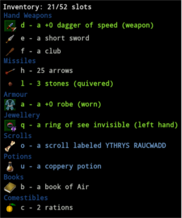
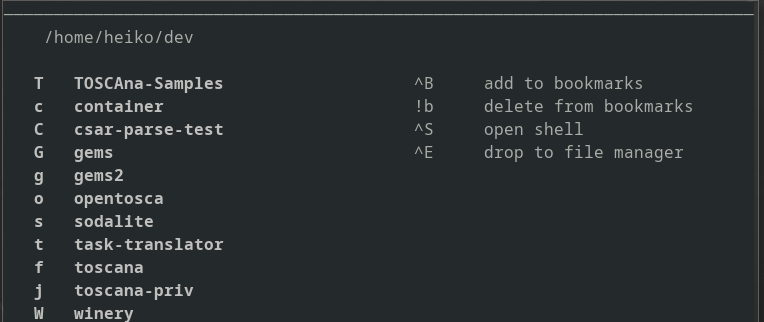

# Sodalite: Exploration at the speed of thought

## Yet another file explorer
Have you ever played [crawl](https://crawl.develz.org/)?
That's a terminal based roguelike dungeon crawler.  
What makes it stand out is it's extremely efficient menu navigation philsophy. 



*Dungeon Crawl Stone Soup: For selecting an item, press it's automatically assigned key.*

After a while, the keys burn into one's muscle memory - using the game's interface feels extremely efficient.  
`sodalite` brings the same asset to your file system: Navigation at the speed of thought.

## Navigate the file system
When opening `sodalite`, you will see the listing of the current directory.   
Pressing one of the keys displayed in front of the entries will navigate there.


On the right side, the current possible actions with their corresponding keybindings are displayed. 
All actions are freely configurable. 

Assign the most intuitive and/or reachable keys to your most frequently used entries, and stick with this assignment. 
Once setup, and muscle memory kicks in, all directories will be reachable in a blink of an eye!

## Installation

#### Arch Linux
AUR package [sodalite](https://aur.archlinux.org/packages/sodalite/):
> `yaourt -S sodalite`


#### OSX
1. Install [brew](https://brew.sh/):
> `/usr/bin/ruby -e "$(curl -fsSL https://raw.githubusercontent.com/Homebrew/install/master/install)"`
2. Install dependencies:
    1. python3: `brew install python3`
    1. other: `pip3 install npyscreen binaryornot pyyaml pyperclip`
3. Proceed with `Manual installation`

#### Manual Installation
In order to manually install `sodalite`, clone this repository, `cd` to the project root and execute:
```bash
sudo ./install
````
For customization of the destination directories, consult [INSTALL](../INSTALL).
> **Necessary dependencies**:  
> - [python3](https://www.python.org/downloads/release/python-364/) 
> - [PyYAML](https://github.com/yaml/pyyaml)
> - [npyscreen](https://github.com/npcole/npyscreen)
> - [binaryornot](https://github.com/audreyr/binaryornot)
> - [pyperclip](https://github.com/asweigart/pyperclip)

## Configuration
`sodalite` needs to get integrated into your favourite shell (supported: `bash`, `zsh`, `fish`).  

#### bash / zsh
Simply add following line to your `.bashrc` / `.zshrc`:

```bash
source /usr/share/sodalite/shell-integration.sh
```
The script will set up a keybinding which launches `sodalite`.
* Emacs keymap:     `Control + f`
* Vim keymap:       `f` in command (aka normal) mode

#### fish
Create the function `fish_user_key_bindings` in your `config.fish` (if not already exists). 
Then, insert following line into the function:
```bash
source /usr/share/sodalite/shell-integration.fish
```

*If your favourite shell is not supported, feel free to open an issue.*

## Getting started
See [here](docs/usage.md) for detailed usage information.

## Changelog
Don't miss out on what has changed: Read the [changelog](changelog.md).

## What the future might bring
Current plans for the future involve (in roughly this order):
- Make exploring the file system more awesome
- Add `tabbing`
- Add an `operation` mode which allows for `yanking`, `deleting`, `renaming` and `moving` files

## License
See [COPYING](COPYING).
