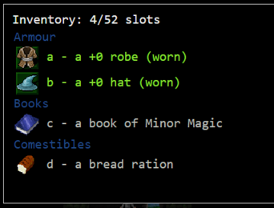

# Sodalite: Exploration at the speed of thought

## Yet another file explorer
Have you ever played [crawl](https://crawl.develz.org/)?
That's a terminal based roguelike dungeon crawler.  
What makes it stand out is it's extremely efficient menu navigation philsophy. 



*Dungeon Crawl Stone Soup: For selecting an item, press it's automatically assigned key.*

After a while, the keys burn into one's muscle memory - using the game's interface feels extremely efficient.  
`sodalite` brings the same feature to your file system: Navigation at the speed of thought.

## Navigate the file system
When opening `sodalite`, you will see the listing of the current directory.   
Pressing one of the keys displayed in front of the entries will navigate there.


Assign the most intuitive and/or reachable keys to your most frequently used entries, and stick with this assignment. 
Once setup, and muscle memory kicks in, all directories will be reachable in a blink of an eye!

## Installation

#### Linux

##### Debian and derivates
You can use this two-liner and you're ready to go:
```bash
curl -sLf repo.hnicke.de/apt/debian/add-repo | sudo bash
sudo apt-get install sodalite
```
The `add-repo` script adds the repository `repo.hnicke.de/apt/debian/repos` to your apt repositories and installs the necessary public keys.

*Note:* Sodalite depends on python3 (>=3.6). If you're running debian (stable), you probably have to manually install it first.

> We're working on getting the package into the official debian repo.

##### Arch Linux
AUR package [sodalite](https://aur.archlinux.org/packages/sodalite/) (stable release):
> `yaourt -S sodalite`

AUR package [sodalite-git](https://aur.archlinux.org/packages/sodalite-git/) (master branch):
> `yaourt -S sodalite-git`


#### OSX
1. Install [brew](https://brew.sh/):
> `/usr/bin/ruby -e "$(curl -fsSL https://raw.githubusercontent.com/Homebrew/install/master/install)"`
2. Install dependencies:
    1. python3: `brew install python3`
    2. other: `pip3 install -r requirements.txt`
3. run `sudo make install`

#### Manual Installation
In order to manually install `sodalite`, clone this repository, `cd` to the project root and execute:
```bash
sudo make install
```

The project adheres to the [GNU Makefile Conventions](https://www.gnu.org/prep/standards/html_node/Makefile-Conventions.html#Makefile-Conventions). 
In case it doesn't it's considered a bug - please file a bug report.

> **Necessary dependencies**:  
> - [python3](https://www.python.org/downloads/release/python-364/)  (>=3.6)
> - [urwid](http://urwid.org)
> - [pygments](http://pygments.org)
> - [binaryornot](https://github.com/audreyr/binaryornot)
> - [PyYAML](https://github.com/yaml/pyyaml)
> - [pyperclip](https://github.com/asweigart/pyperclip)
> - [watchdog](https://github.com/gorakhargosh/watchdog)

## Getting started
Check out the [manpage](docs/sodalite.1.md) for detailed usage information.

## Changelog
Don't miss out on what has changed: Read the [changelog](changelog.md).

## Contributing
Do you want to contribute to the project? Check out the [developer guide](docs/developer_guide.md).

## What the future might bring
Current plans for the future involve (in roughly this order):
- Make exploring the file system more awesome
- Add `tabbing`
- Add an `operation` mode which allows for `yanking`, `deleting`, `renaming` and `moving` files

## License
See [copyyright](copyright).
